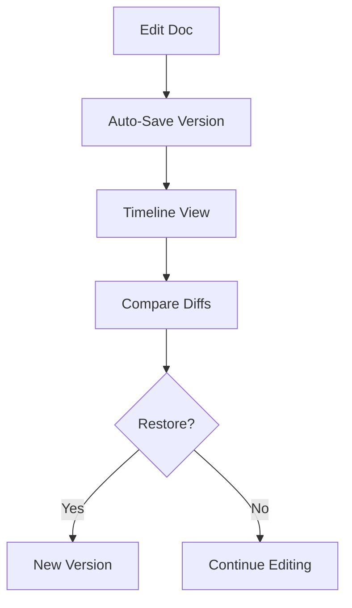

## Overview

BG Ventures provides powerful tools to streamline your documentation workflow. You organize content with intuitive folder structures, collaborate seamlessly with teams, track changes through version history, and find information quickly with advanced search. These core features help you build professional, maintainable docs for any project.

<Columns cols={2}>
  <Card title="Document Structuring" icon="folder" href="#document-structuring">
    Create nested folders and organize docs hierarchically.
  </Card>
  <Card title="Collaboration" icon="users" href="#collaboration">
    Invite teammates and share docs securely.
  </Card>
  <Card title="Version History" icon="git-branch" href="#version-history">
    Track changes and revert to previous versions.
  </Card>
  <Card title="Search" icon="search" href="#search">
    Full-text search across all your documentation.
  </Card>
</Columns>

## Document Structuring and Folders

You structure your documentation using folders to create a clear hierarchy. Start by creating a root folder for your project, then nest subfolders for sections like `api`, `guides`, and `tutorials`.

<Steps>
  <Step title="Create a Folder" icon="folder-plus">
    Navigate to your workspace dashboard. Click the `{New Folder}` button and enter a name like `API Reference`.

    ```
    Folder structure example:
    /project-docs
      /api
        endpoints.mdx
      /guides
        quickstart.mdx
    ```
  </Step>
  <Step title="Move Documents" icon="move">
    Drag and drop files into folders. Use the `{Organize}` panel to bulk-move items.
  </Step>
  <Step title="Publish Hierarchy" icon="globe">
    Your folder structure automatically generates a navigable sidebar in the published site.
  </Step>
</Steps>

<Callout kind="tip">
  Limit nesting to three levels deep to keep navigation intuitive for readers.
</Callout>

## Collaboration and Sharing Options

Invite team members to collaborate in real-time. You control access with granular permissions.

<Tabs>
  <Tab title="Team Invite" icon="mail">
    Generate invite links or add users by email.

    ```
    ```bash
    curl -X POST https://api.example.com/v1/workspaces/{workspaceId}/invites \\
      -H "Authorization: Bearer YOUR_API_KEY" \\
      -d '{"email": "team@company.com", "role": "editor"}'
    ```
    ```
  </Tab>
  <Tab title="Public Sharing" icon="share-2">
    Publish read-only versions.

    <Image
      src="https://via.placeholder.com/600x300/3B82F6/white?text=Public+Share+Link"
      alt="Public sharing dialog"
      width="600"
      height="300"
    />
  </Tab>
  <Tab title="Embed Docs" icon="code">
    Embed specific pages in your site.

    ```html
    <iframe src="https://docs.example.com/embed/project/api" width="100%" height="600"></iframe>
    ```
  </Tab>
</Tabs>

## Version History and Updates

Every edit creates a version snapshot. You review changes, compare diffs, and restore previous states.

<ExpandableGroup>
  <Expandable title="View History" default-open="true">
    Right-click a document and select `{View History}`. See a timeline of commits with previews.
  </Expandable>
  <Expandable title="Revert Changes">
    Select a version and click `{Restore}`. This creates a new version based on the selected one.
  </Expandable>
</ExpandableGroup>



## Search Functionality

Search across all documents with full-text indexing. You query titles, content, and metadata.

<CodeGroup tabs="Advanced,Simple">
  ```javascript
  // API search example
  const results = await fetch('https://api.example.com/v1/search', {
    method: 'POST',
    headers: { 'Authorization': 'Bearer YOUR_API_KEY' },
    body: JSON.stringify({
      query: 'authentication',
      filters: { folder: 'api' }
    })
  });
  ```
  ```javascript
  // Simple client-side search
  const query = 'version history';
  // Returns matching docs
  ```
</CodeGroup>

| Feature | Description | Supported |
|---------|-------------|-----------|
| Full-text | Searches content and titles | Yes |
| Filters | By folder, tag, date | Yes |
| Highlights | Shows matching snippets | Yes |

<Callout kind="info">
  Search indexes update in real-time. Use tags like `{feature}` or `{bugfix}` for better organization.
</Callout>